# Playwright Blob Test Run Import — Implementation Plan

## 1. Decision Summary

Add a synchronous, format-neutral test-run import API whose first adapter reads TypeScript Playwright blob reports.

For the first release:

- Accept one or more Playwright blob `.zip` files in one multipart request.
- Treat the request as one logical Observer run and each blob as one run execution/shard.
- Expose it at the versioned report route `POST /api/v1/imports/playwright/blob/v2`.
- Support Playwright blob schema version `2` only. Reject version `1` and versions newer than `2` with a clear compatibility error.
- Parse the ZIP and `report.jsonl` directly in Go; do not add Node.js or `@playwright/test` to the API runtime.
- Build a complete, format-neutral import bundle before persisting it.
- Persist the run, executions, suites, tests, attempts, steps, outputs, errors, attachments, and statistics in one PostgreSQL transaction.
- Generate deterministic IDs from report content so retrying the same upload is idempotent.
- Add an import dialog to the Test Runs page and navigate to the imported run after success.

This approach fits the current Go API/PostgreSQL architecture and preserves a clean boundary for future JUnit, pytest, or other import adapters.

## 2. Playwright Format Facts

The plan relies on the following behavior from Playwright's official implementation:

- A blob report is a ZIP containing `report.jsonl` and, when present, attachment files under `resources/`.
- The current blob schema version is `2` and is declared in the initial `onBlobReportMetadata` event.
- The JSONL is a sequence of reporter events such as `onConfigure`, `onProject`, `onTestBegin`, `onStepBegin`, `onAttach`, `onTestEnd`, `onStdIO`, and `onEnd`.
- Times and durations in the JSON events are milliseconds; Observer stores durations in nanoseconds.
- A blob contains Playwright's version in `metadata.userAgent` and shard information in `metadata.shard`.
- Official merge behavior salts duplicate test IDs across input blobs and guards attachment paths against escaping the resource directory.

References:

- [Playwright blob reporter documentation](https://playwright.dev/docs/test-reporters#blob-reporter)
- [Playwright sharded report documentation](https://playwright.dev/docs/test-sharding#merging-reports-from-multiple-shards)
- [Playwright blob writer source](https://github.com/microsoft/playwright/blob/main/packages/playwright/src/reporters/blob.ts)
- [Playwright blob event types](https://github.com/microsoft/playwright/blob/main/packages/playwright/src/isomorphic/teleReceiver.ts)
- [Playwright merge implementation](https://github.com/microsoft/playwright/blob/main/packages/playwright/src/reporters/merge.ts)

Because the blob schema is an internal, versioned Playwright format rather than a stable public JSON schema, compatibility must be explicit and fixture-tested.

## 3. Scope

### Included in the MVP

- Blob schema v2.
- Single-report runs and multi-blob sharded runs.
- Multiple projects in a run.
- Retries and Observer flaky-status aggregation.
- Playwright expected failures, unexpected passes, annotations, and discovered-but-not-run tests.
- Nested suites and steps.
- Test-scoped stdout and stderr.
- Test and step errors.
- Inline and resource-file attachments, including traces, images, videos, and text.
- Deterministic idempotency.
- Synchronous REST upload and UI feedback.
- AIO and distributed API deployments.

### Deferred

- Blob schema v1 modernization.
- Automatically running a matching Playwright version to read unknown formats.
- Asynchronous/resumable imports and persistent import-job history.
- Upload by URL, cloud bucket, CI provider, or command-line client.
- Combining files uploaded in separate requests into one logical run.
- Live per-test WebSocket replay for imported runs.
- Editing imported run identity or metadata after import.

## 4. Proposed Data Flow

```mermaid
flowchart LR
  UI["Test Runs import dialog"] -->|"multipart: reports[]"| API["POST /api/v1/imports/playwright/blob/v2"]
  API --> TMP["Bounded temporary files"]
  TMP --> DETECT["Format detection and limits"]
  DETECT --> PW["Playwright blob v2 adapter"]
  PW --> BUNDLE["Normalized RunImportBundle"]
  BUNDLE --> ART["Attachment storage service"]
  ART --> TX["Atomic PostgreSQL import"]
  TX --> RESULT["Run ID, summary, warnings"]
  RESULT --> UI
```



The importer writes directly to PostgreSQL rather than publishing thousands of synthetic live events to NATS. Imported data is already complete, so replaying begin/end events would add ordering, buffering, duplicate-delivery, and latency concerns without improving correctness. The UI refreshes after the import response.

## 5. Format-Neutral Import Boundary

Create `pkg/importer` with an interface such as:

```go
type ReportType struct {
    Producer string
    Format   string
    Version  string
}

type Importer interface {
    ReportType() ReportType
    Probe(ctx context.Context, files []SourceFile) (ProbeResult, error)
    Parse(ctx context.Context, files []SourceFile) (*RunImportBundle, error)
}
```

`RunImportBundle` should contain only Observer-oriented values:

- `Run`
- `Executions`
- `Suites`, already ordered parent before child
- `Tests`
- `Attempts`, including nested steps, output, failures, and errors
- `Attachments`, represented as source references until storage is complete
- `Warnings`
- `Source`, including format, schema version, producer version, hashes, and original filenames

The registry keys adapters by the full `(producer, format, version)` tuple. For the MVP, the only registered tuple is `(playwright, blob, v2)`. The API handler selects the adapter from the URL and the adapter probes the uploaded ZIP content so a mismatched or invalid file cannot reach persistence.

Keep Playwright JSON types private to `pkg/importer/playwrightblob`. Neither API code nor repository code should depend on the upstream event shape.

## 6. URL and Versioning Structure

Use this canonical route shape for all report imports:

```text
/api/{apiVersion}/imports/{producer}/{format}/{reportVersion}
```

The segments have distinct responsibilities:

| Segment | Meaning | Example |
| --- | --- | --- |
| `apiVersion` | Observer's HTTP request/response contract | `v1` |
| `producer` | Framework or ecosystem that produced the report | `playwright` |
| `format` | Report representation within that ecosystem | `blob` |
| `reportVersion` | Version of the supported report schema/profile | `v2` |

The first supported upload URL is:

```text
POST /api/v1/imports/playwright/blob/v2
```

`v1` and `v2` are intentionally independent. A future breaking change to Observer's upload or response contract would use `/api/v2/...`; a new Playwright blob schema would be added alongside the current adapter at `/api/v1/imports/playwright/blob/v3`.

This introduces versioning for the new import surface only. Existing endpoints such as `/api/runs` and `/api/tests` remain unchanged; migrating the entire legacy REST API under `/api/v1` is outside this feature. The frontend's existing `/api` base URL therefore calls import paths beginning with `/v1/imports/...`.

For formats that declare an upstream schema version, `reportVersion` mirrors it. Playwright blob's `v2` route therefore requires `onBlobReportMetadata.params.version == 2`. For formats without a declared version, the segment identifies Observer's compatibility profile for that representation and begins at `v1`. Once published, a profile must not be silently reinterpreted; incompatible parsing changes require a new report-version route.

Use lowercase, URL-safe identifiers:

- `producer` and `format`: `^[a-z][a-z0-9-]*$`
- `reportVersion`: `^v[1-9][0-9]*$`

Illustrative future routes—not commitments to implement them in this work—include:

| Report family | Canonical upload URL |
| --- | --- |
| Playwright blob schema 2 | `/api/v1/imports/playwright/blob/v2` |
| Playwright blob schema 3 | `/api/v1/imports/playwright/blob/v3` |
| Playwright JSON compatibility profile 1 | `/api/v1/imports/playwright/json/v1` |
| JUnit XML compatibility profile 1 | `/api/v1/imports/junit/xml/v1` |
| pytest JSON compatibility profile 1 | `/api/v1/imports/pytest/json/v1` |

Do not add a generic auto-detecting upload endpoint such as `POST /api/v1/imports` in the MVP. Explicit routing makes compatibility deterministic, makes authorization/rate limits configurable per report family, and prevents the meaning of an existing URL from changing when adapters are added.

### Capability discovery

Provide a read-only discovery endpoint:

```text
GET /api/v1/imports
```

It returns the registered adapters and their limits so the web UI and future clients do not hard-code the list:

```json
{
  "data": [
    {
      "producer": "playwright",
      "format": "blob",
      "reportVersion": "v2",
      "uploadPath": "/v1/imports/playwright/blob/v2",
      "fileExtensions": [".zip"],
      "multipleFiles": true,
      "maxFiles": 32,
      "maxRequestBytes": 536870912,
      "externalAttachments": true,
      "inlineAttachmentBytes": 102400
    }
  ]
}
```

`uploadPath` is relative to the configured API base. The frontend resolves it with the existing `apiUrl()` helper, producing `/api/v1/...` by default while still working when `VITE_API_URL` points at another origin or base path. An optional `GET /api/v1/imports/{producer}/{format}/{reportVersion}` capability endpoint may be added later if per-adapter guidance outgrows the index response.

### Lookup and compatibility errors

Route all canonical uploads through one parameterized handler and then look up the exact tuple in the registry:

- Unknown `producer` or `format`: `404` with `unsupported_report_type`.
- Known producer/format but unknown `reportVersion`: `422` with `unsupported_report_version` and `supportedVersions`.
- Uploaded content whose detected version differs from the URL: `422` with `report_version_mismatch`, `requestedVersion`, and `detectedVersion`.
- A recognized version that cannot be parsed safely: `422` with the adapter-specific compatibility error.

Do not redirect between report-version upload routes. A client must consciously select the matching adapter.

## 7. Upload API Contract

Register a new route:

```text
POST /api/v1/imports/playwright/blob/v2
Content-Type: multipart/form-data

name=<optional display name>
reports=<one or more .zip files>
```

Success for a new import:

```json
{
  "data": {
    "runId": "pwb-<digest>",
    "created": true,
    "reportType": {
      "producer": "playwright",
      "format": "blob",
      "version": "v2"
    },
    "files": 4,
    "warnings": [],
    "statistics": {
      "total": 128,
      "passed": 120,
      "failed": 6,
      "flaky": 2,
      "skipped": 0
    }
  }
}
```

- Return `201 Created` for a new run.
- Return `200 OK` with `created: false` when the exact same set of blobs was imported previously.
- Return structured error JSON with a stable `code`, user-safe `message`, and optional per-file details.
- Use `400` for malformed multipart or invalid archives, `413` for limits, `415` for media-type mismatch, `422` for a valid but unsupported report version, content/path version mismatch, or inconsistent shard set, `503` when required attachment storage is unavailable, and `500` for unexpected persistence failures.

Suggested error codes include `invalid_archive`, `missing_report_jsonl`, `unsupported_report_type`, `unsupported_report_version`, `report_version_mismatch`, `inconsistent_reports`, `incomplete_shard_set`, `upload_too_large`, and `attachment_storage_required`.

## 8. Identity and Idempotency

Blob reports do not contain an Observer run ID. Generate identities as follows:

1. Compute SHA-256 for each uploaded ZIP while copying it to its bounded temporary file.
2. Reject duplicate ZIP hashes within one request.
3. Sort the individual hashes and hash the canonical list with a producer/format/report-version prefix.
4. Use `pwb-<first 32 hex characters>` as the logical run ID.
5. Use `pwbx-<first 24 hex characters of the individual ZIP hash>` as each execution ID.

This makes file ordering irrelevant and makes retrying an upload safe. Store the full hashes in `runs.metadata.source`, not only the shortened IDs.

After all file hashes are known, perform an early read-only lookup by run ID and full source digest before parsing or uploading resources. This avoids expensive duplicate work in the common retry case. The advisory-locked check in the final database transaction remains authoritative and closes the concurrency race.

For concurrent duplicate uploads, take a PostgreSQL transaction-scoped advisory lock derived from the run ID. Under the lock:

- If a run exists with the same source digest, return it as an idempotent success.
- If the ID exists with different provenance, fail closed as an identity conflict.
- Otherwise create the entire run in one transaction.

Run deletion must acquire the same per-run advisory lock before collecting attachment keys and deleting rows. Acquire locks in sorted run-ID order for multi-delete requests. Otherwise an import can return an idempotent success while the same run is concurrently disappearing.

Do not allow a caller-supplied run ID in the MVP. An optional name affects display metadata but not identity. If the same content is imported again with a different name, return the existing run unchanged and include a warning that the requested name was not applied.

Resolve the run display name in this order:

1. A non-empty, length-limited multipart `name` value.
2. An allowlisted Playwright run/bot name or tag when it is unambiguous.
3. `Playwright run <source start time in UTC>`.

This guarantees the non-null `run_stats.name` field without making import time part of deterministic identity.

## 9. Playwright-to-Observer Mapping

| Playwright source | Observer target | Rule |
| --- | --- | --- |
| Blob metadata | Run/execution metadata | Preserve blob version, user agent, path separator, shard, filename, and SHA-256. |
| `onConfigure.config` | Run metadata | Preserve version, workers, rootDir, tags, and other allowlisted run configuration. |
| `onProject` | Synthetic project suite | Create one root suite per project. Preserve project name, retries, timeout, and metadata, but do not persist the arbitrary `use` object. |
| Nested `JsonSuite` | Suite | Derive a stable ID from project, ancestor titles, location, and sibling position. Preserve hierarchy and location. |
| `JsonTestCase` | Test | Preserve Playwright `testId` as `external_test_id`, title, tags, location, timeout, retries, repeat index, expected status, and annotations. Create `NOT_RUN` tests even when no result event follows discovery. |
| `onTestBegin.result` | TestAttempt start | Use `retry` as `attempt_index`, `id` to correlate later events, and convert start milliseconds to `time.Time`. |
| `onTestEnd.result` | TestAttempt end | Map semantic Observer status, raw actual/expected status, duration, errors, annotations, and attachments. |
| `onStepBegin`/`onStepEnd` | Attempt `steps` JSONB | Correlate by result ID and parent step ID, preserve category/location, and construct a deterministic tree. Derive step status from error/completion because Playwright's step-end payload has no explicit status. |
| `onStdIO` | Attempt stdout/stderr | Decode base64 when indicated; preserve order. Global output is summarized as a warning in the MVP. |
| `onAttach` | Attempt attachment | Deduplicate against legacy `onTestEnd.result.attachments`; link to a step when the event relationship permits it. |
| `onError` | Run metadata/global error | Preserve sanitized global error details because the current schema has no run-error table. |
| `onEnd.result` | Execution status/timing | Map final status and use its start time/duration. Logical run aggregation uses all executions. |

### Status mapping

| Playwright | Observer |
| --- | --- |
| `passed` | `PASSED` |
| `failed` | `FAILED` |
| `timedOut` / `timedout` | `TIMEDOUT` |
| `skipped` | `SKIPPED` |
| `interrupted` | `INTERRUPTED` |
| missing/unknown | `UNKNOWN` |

Retries use the existing attempt aggregation: a failed attempt followed by a passed attempt produces `FLAKY`. Test start/end ranges are derived from their attempts. Suite status and timing are derived bottom-up from descendants. Run status comes from the imported execution end results, with existing logical execution aggregation applied for multiple blobs.

### Expected-status semantics

Observer's visible status must represent Playwright's semantic outcome, not blindly copy `TestResult.status`:

- Actual status matches expected `passed` or `failed`: store Observer attempt status `PASSED` and preserve the raw actual/expected statuses and any error in attempt metadata.
- Actual `passed` when `failed` was expected: store `FAILED` as an unexpected pass and record the reason in metadata even though no Playwright error may exist.
- Actual failure/timed out/interrupted when `passed` was expected: use the corresponding Observer failure status.
- Actual or expected skip: use `SKIPPED` when Playwright reports a skipped result.
- A discovered test with no result events: use `NOT_RUN` and do not synthesize an attempt.

This representation allows the existing Observer retry aggregation to reproduce Playwright's expected, unexpected, flaky, skipped, and not-run outcomes. It is also required because REST hydration recalculates test status from attempt statuses; setting only the stored test row would be overwritten on read.

### Duplicate test IDs across blobs

Match Playwright merge semantics:

- The first occurrence retains the stable internal ID derived from the Playwright test ID.
- Later occurrences in other blobs are deterministically salted with the execution digest.
- All occurrences retain the original Playwright ID in `external_test_id` and provenance metadata.

This handles multi-environment reports without breaking the `(run_id, test_id)` primary key.

### Multi-blob grouping rules

Define exactly which file sets form one logical run in the MVP:

- One unsharded blob is valid.
- Multiple unsharded blobs are treated as separate executions/environments and may contain duplicate test IDs, which are salted as described above.
- A sharded import must contain one complete shard set: every blob declares the same positive shard total and indexes cover `1..total` exactly once.
- Reject incomplete shard sets, duplicate shard indexes, mixed sharded/unsharded blobs, and multiple independent shard groups in one request.
- Preserve differing environment tags and project names, but reject incompatible root test directories unless they normalize to the same logical root using each blob's declared path separator.

Supporting multiple environments where each environment is itself sharded requires an explicit execution-group key and is deferred. The API must return `incomplete_shard_set` or `inconsistent_reports` rather than silently importing partial results.

## 10. Parser Design

Implement the adapter in `pkg/importer/playwrightblob`:

1. Open each temporary upload with `archive/zip`.
2. Validate the central directory before reading content.
3. Require exactly one root-level `report.jsonl`.
4. Read and validate `onBlobReportMetadata` before accepting other events.
5. Parse JSONL incrementally as an envelope of `method` plus `json.RawMessage` params.
6. Decode only known events into private typed structs.
7. Build indexes for projects, tests, result IDs, steps, output, and attachments.
8. Validate references, complete result correlation, required terminal events, and the request's multi-blob grouping rules after the stream is consumed.
9. Normalize each blob into one execution, then merge the executions into one bundle in canonical hash order.

Unknown event methods in schema v2 should produce a warning and be ignored. Unknown required fields or an unknown schema version should fail the import.

A missing attachment resource is not a malformed report. Playwright's blob writer can omit a path attachment if the source file no longer exists when the ZIP is finalized. Preserve the attachment metadata with `available: false`, emit a bounded warning, and continue. Unsafe resource paths, duplicate normalized entries, corrupt resource bytes, or checksum failures remain fatal.

Do not use `bufio.Scanner` with its small default token limit. Use a bounded reader that supports explicitly configured large JSONL records and reports the line number on malformed input.

## 11. Attachment Handling

Extract attachment processing from the private NATS consumer method into a shared service used by live ingestion and imports.

The service should:

- Accept a name, MIME type, size, checksum, and reader.
- Keep small payloads inline using the existing base64 map shape expected by the web UI.
- Stream large payloads to the configured storage driver without loading them fully into memory.
- Return the existing attachment map fields: `name`, `mime_type`, `size`, `storage`, `storage_key`, `storage_uri`, `content`, and `content_encoding` as applicable.
- Preserve Playwright attachment metadata such as source resource path and optional step ID under namespaced metadata.
- Track every external storage key created during an import.

Evolve `storage.Driver.Upload` from separate name/MIME arguments to a request object carrying `Name`, `MimeType`, optional declared `Size`, optional `Checksum`, and `Content`. Update local/S3 drivers and live-ingestion callers together. This avoids hidden type assertions and gives storage backends the information needed to choose a bounded upload strategy.

Before the database transaction, store all referenced resources. If parsing, storage, or persistence fails, delete newly created external objects on a best-effort basis and log cleanup failures. If no storage driver is configured, allow only attachments below the configured inline threshold; reject the run before database writes if larger attachments are present.

The MVP should continue storing attachment maps on `test_attempts` because that is the data path currently read by `AttachmentsCard` and `FindAttachmentByStorageKey`. Populating the separate `attachments` table can be a later normalization project and should not block import.

The current S3 driver calls `io.ReadAll`, so adding a shared attachment service alone does not make large imports memory-safe. Refactor `pkg/storage/s3.go` as part of this feature to upload from a seekable temporary file or bounded multipart stream. The shared service should spool a ZIP entry once when the storage backend requires seeking, pass size/checksum metadata through the upload, and remove the spool file afterward. Add cancellation and large-object tests for both local and S3-compatible drivers.

Imported artifacts also need an end-of-life path. Before deleting runs, collect external `storage_key` values from attempt, failure, and error attachment maps; delete the relational rows transactionally; then remove the external objects with retryable, best-effort logging. Because live-ingested runs use the same maps, this closes an existing leak for both live and imported data. If deletion cleanup is intentionally split into a later change, the import feature must be documented as not production-ready for large artifacts.

## 12. Atomic Persistence

Add a purpose-built repository method rather than calling the existing event-oriented methods one at a time:

```go
ImportRun(ctx context.Context, bundle *RunImportBundle) (created bool, err error)
```

Within one PostgreSQL transaction:

1. Acquire the advisory lock and perform the idempotency check.
2. Insert the logical run.
3. Insert executions.
4. Insert suites in parent-before-child order.
5. Insert tests.
6. Insert attempts with steps, outputs, errors, and attachment maps.
7. Derive and persist test and suite aggregate fields.
8. Compute `run_stats` using the existing status-count rules and the imported source duration.
9. Refresh logical run aggregation from executions.

Prefer create-only semantics for a new content-derived run. Do not partially merge imported content into an existing live run.

No database migration is required for the MVP: provenance and warnings fit in run/execution metadata, and all execution data fits the current relational tables. If asynchronous jobs are added later, introduce a separate `run_imports` table then.

Do not call the current `collectRunStats` duration calculation unchanged for historical imports: it derives duration from database creation time, which would report import processing time or time since an old source run. For imports, set `run_stats.duration` from the logical source run duration in milliseconds while run/test/attempt duration fields remain nanoseconds.

Use these timestamp semantics consistently:

- `started_at` / `finished_at`: source Playwright execution times.
- Entity `created_at` / `updated_at`: Observer persistence times.
- `run_stats.created_at`: source run start time so run-list ordering reflects when the test ran, falling back to import time only when source time is unavailable.
- `runs.metadata.source.imported_at`: Observer import time for auditing.

## 13. Safety and Resource Limits

Add configurable limits with conservative defaults:

- Total HTTP request bytes.
- Number of report files.
- Compressed and uncompressed bytes per ZIP.
- Total uncompressed bytes across all ZIPs.
- ZIP entry count.
- `report.jsonl` bytes and maximum JSONL record bytes.
- Total decoded JSONL, output, error, warning, and normalized-bundle bytes.
- Test, step, output, error, and attachment counts.
- Per-attachment and total inline attachment bytes.
- Import processing timeout.
- Concurrent imports per API instance.

Reject:

- Absolute paths, backslashes used to evade validation, `..`, NULs, symlinks, and duplicate normalized ZIP entry names.
- Resources outside `resources/`.
- ZIPs with suspicious compression ratios or declared sizes above configured limits.
- Mixed blob schema versions in one request.
- Incomplete shard sets, mixed sharded/unsharded files, or shard metadata with inconsistent totals, duplicate indexes, or invalid ranges.

Never extract the archive tree to disk. Read validated entries directly from the ZIP. Temporary upload files must use a private directory, restrictive permissions, request-scoped names, and guaranteed cleanup on success, error, cancellation, and panic recovery.

Use `http.MaxBytesReader` before creating the multipart reader and process parts incrementally rather than calling `ParseMultipartForm` without control over its spill behavior. Gate parsing/storage with a small weighted semaphore so several maximum-sized synchronous imports cannot exhaust API memory, temporary disk, database connections, or storage bandwidth. Return `429` or `503` with `import_capacity_exceeded` when capacity cannot be acquired within a short bounded wait.

Cap the number and serialized size of warnings returned to the client. Log the omitted warning count instead of allowing a malformed report to create an unbounded response.

Do not store Playwright's arbitrary `config.use` object wholesale; it can contain credentials, headers, storage state, or other secrets. Persist an allowlisted subset and counts/names for omitted fields.

## 14. API and Deployment Changes

### Backend

- Initialize the shared attachment service and tuple-keyed importer registry in `cmd/api/main.go`.
- Register `GET /api/v1/imports` and `POST /api/v1/imports/{producer}/{format}/{reportVersion}` in a new API handler.
- Route imports through the API's central authentication middleware when one is configured, and reserve an `imports:create` authorization capability before production auth is enabled. When cookie-based auth is introduced, require the platform's CSRF protection on this multipart write route. Until then, deployments must protect the write endpoint at the gateway consistently with the existing delete/marker endpoints.
- Ensure request cancellation reaches file copy, parsing, storage, and database calls.
- Integrate active imports with graceful shutdown: stop admitting new imports, cancel or drain active imports, allow rollback/artifact cleanup to finish, and make shutdown grace compatible with the configured import timeout instead of relying on the API's current fixed five-second window.
- Add import-specific structured logs: request ID, format, file count, byte counts, schema/producer version, run ID, duration, entity counts, warning count, and outcome.
- Add counters/histograms when the project adds its metrics endpoint; until then, keep log field names stable.

### Reverse proxy and Helm

Nginx defaults are too small for typical blob reports. Add an import-specific `/api/v1/imports/` location or configuration that sets:

- `client_max_body_size`
- `client_body_temp_path` where needed
- longer upload/send/read timeouts than ordinary API calls
- `proxy_request_buffering off` so Nginx does not create a second full temporary copy before the API performs its own bounded spool

Expose matching settings in Helm values for distributed deployments and document ingress-controller body-size/timeouts when ingress is managed outside this chart. Mount a dedicated writable `emptyDir` at `IMPORT_TMP_DIR` in the distributed API pod, give it a configurable `sizeLimit`, and include ephemeral-storage requests/limits. The AIO chart's existing `/tmp` volume must be sized and tested for the configured maximum request plus attachment spooling. This keeps imports working if containers later enable `readOnlyRootFilesystem` and prevents node-disk exhaustion.

Distributed mode also needs one authoritative artifact-storage configuration shared by the API importer, processor, and attachment-serving handler. Add chart values/secret wiring for S3-compatible storage, or explicitly support a shared RWX volume for the local driver. Do not use pod-local artifact storage when the API has multiple replicas: an import uploaded by one pod would not be retrievable from another. Capability discovery should indicate whether large external attachments are currently supported.

### Configuration

Use `IMPORT_`-prefixed environment variables, for example:

- `IMPORT_MAX_REQUEST_BYTES`
- `IMPORT_MAX_FILES`
- `IMPORT_MAX_UNCOMPRESSED_BYTES`
- `IMPORT_MAX_JSONL_RECORD_BYTES`
- `IMPORT_MAX_DECODED_BYTES`
- `IMPORT_TIMEOUT`
- `IMPORT_SHUTDOWN_GRACE`
- `IMPORT_MAX_CONCURRENT`
- `IMPORT_TMP_DIR`
- `IMPORT_INLINE_ATTACHMENT_BYTES`

Provide secure defaults in code and make the Helm/AIO values explicit.

## 15. Web UI

Add an always-visible `Import run` action beside `Refresh` in `web/src/pages/TestRunsPage/TestRunsPage.tsx`. It is independent of row selection and must remain available when the run list is empty. On narrow screens, allow the header actions to wrap without hiding the import action.

Use the existing dialog and style tokens, but create a dedicated `ImportTestRunDialog` because file selection, capability discovery, warnings, and upload state exceed the generic single-input dialog's responsibility.

### Capability discovery and report selection

- Fetch `GET /api/v1/imports` when the dialog first opens and cache the result for the page session.
- Render report choices from the capability response rather than hard-coding endpoints.
- For the MVP, select `Playwright / Blob / v2` and submit to `apiUrl(adapter.uploadPath)`.
- Keep the report selector visible even with one option so the producer/format/version model is clear and future adapters can appear without redesigning the dialog.
- If discovery fails or returns no adapters, disable file submission and show a retryable `Import is unavailable` state.
- Surface advertised file-count, request-size, extension, inline-attachment, and external-attachment capabilities before selection.

### File selection and validation

- Accept one or more `.zip` files through both a native file picker and a keyboard-operable drag/drop target.
- Show each file's name and human-readable size, the aggregate size, and a remove action.
- Reject duplicate local files by name/size/last-modified as an early convenience check; the server's content hash remains authoritative.
- Enforce advertised extension, file-count, and total-request limits client-side for immediate feedback while treating server validation as authoritative.
- Explain that all selected files become one logical run and that a sharded run must include its complete shard set.
- Offer an optional, length-limited display name and state that changing the name does not create a duplicate when the same report content already exists.
- Warn before submission when the server reports `externalAttachments: false` and selected reports may contain artifacts larger than the inline threshold.

### Dialog states

Model the flow explicitly rather than with unrelated booleans:

```text
loading-capabilities -> ready -> uploading -> success
                              \-> error -> ready
```

- `loading-capabilities`: show a compact skeleton/spinner.
- `ready`: enable Import only when an adapter and valid files are present.
- `uploading`: lock report/file/name edits, show an indeterminate progress indicator, and label the current phase as `Uploading and processing`. Browser `fetch` does not expose reliable upload progress, so do not display a fabricated percentage.
- Provide a Cancel action backed by `AbortController`; cancellation must abort the request and return the dialog to `ready` with selected files intact.
- `error`: preserve correctable input and render the server's stable error code as actionable copy.
- `success`: show created-versus-existing state, imported counts/statistics, and bounded warnings.

Map important server errors to specific guidance:

- `unsupported_report_version` / `report_version_mismatch`: show detected and supported versions.
- `incomplete_shard_set`: list missing or duplicate shard indexes when supplied.
- `upload_too_large`: show the applicable server limit.
- `attachment_storage_required`: explain that large report artifacts require configured storage.
- `import_capacity_exceeded`: offer Retry without clearing files.
- Authentication/authorization failures: do not retry automatically; tell the user access is required.

Do not expose raw backend errors or stack traces in the browser.

### Completion behavior

- On `201`, show `Run imported` with the run ID and summary.
- On idempotent `200` with `created: false`, show `Run already imported`; do not imply a second run was created.
- Keep warnings visible in the success state instead of navigating before the user can read them.
- Provide `View run` as the primary action, navigating to `/runs/{runId}`.
- Provide `Import another` as a secondary action that clears the completed files and returns to `ready` without refetching capabilities.
- Refresh the Test Runs list silently after success so closing the dialog reveals the imported/existing run immediately.

### Accessibility and interaction requirements

- Associate all inputs with visible labels and descriptive help text.
- Make the drop target operable with Enter/Space and retain the native file input for assistive technology.
- Announce capability errors, upload state, cancellation, success, and import errors through an `aria-live` region.
- Move focus to the first error on failed validation and to the success heading after completion.
- Trap focus inside the modal and restore it to the `Import run` button on close; extend the shared `Dialog` component if needed.
- Do not use color alone for success, warning, error, selected adapter, or drag-active states.
- Prevent Escape/overlay close while uploading unless it first performs the same abort behavior as Cancel.

## 16. File-Level Work Plan

### New backend files

- `pkg/importer/importer.go` — report-type tuple, adapter interface, source file, normalized bundle, and common errors.
- `pkg/importer/registry.go` — `(producer, format, version)` registration, exact lookup, and capability listing.
- `pkg/importer/playwrightblob/types.go` — private schema-v2 JSON event types.
- `pkg/importer/playwrightblob/parser.go` — ZIP validation and streaming JSONL decoder.
- `pkg/importer/playwrightblob/builder.go` — event correlation and normalized bundle construction.
- `pkg/importer/playwrightblob/merge.go` — deterministic multi-blob/shard merge.
- `pkg/importer/playwrightblob/ids.go` — content-derived identities.
- `pkg/importer/playwrightblob/status.go` — status and aggregate conversion.
- `pkg/attachments/service.go` — shared inline/external attachment processing and cleanup tracking.
- `internal/repository/postgres/postgres_import.go` — atomic bundle persistence and idempotency.
- `pkg/api/imports.go` — capability index, versioned multipart handler, limits, response, and error mapping.

### Existing backend files

- `cmd/api/main.go` — construct and register the import handler.
- `pkg/consumer/nats_test_handlers.go` and `pkg/consumer/nats_step_handlers.go` — use the shared attachment service.
- `pkg/consumer/nats_consumer.go` and `cmd/processor/main.go` — inject the shared attachment service without changing live event semantics.
- `pkg/api/rest_postgres.go` or a small query helper — resolve the imported run for the response.
- `pkg/storage/driver.go`, `pkg/storage/local.go`, `pkg/storage/s3.go`, and storage tests — add upload size/checksum metadata and replace whole-object `io.ReadAll` behavior with bounded seekable/streaming upload support.
- `internal/repository/postgres/postgres_query_mutations.go` and the delete-run handler — enumerate and clean external attachment objects when a run is deleted.
- `docker/nginx/nginx.aio.conf.template` and `docker/nginx/nginx.web.conf.template` — import upload limits/timeouts.
- `Dockerfile.api` and `Dockerfile.aio` — only copy new Go packages; no Node runtime change.
- Helm values/schema/templates and deployment documentation — expose import settings.

### Frontend files

- `web/src/pages/TestRunsPage/ImportTestRunDialog.tsx` — new upload UI.
- `web/src/pages/TestRunsPage/TestRunsPage.tsx` — launch dialog, refresh the list after success, and navigate to the imported run.
- `web/src/lib/imports.ts` — capability discovery, multipart upload, abort handling, and structured error parsing.
- `web/src/types/import.ts` — adapter capability, response, warning, statistics, and structured error types.
- `web/src/components/Dialog.tsx` — add focus trapping/restoration and upload-safe dismissal behavior if the dedicated dialog cannot provide these through existing props.

## 17. Test Strategy

### Parser unit tests

Generate ZIP fixtures in tests rather than committing large opaque binaries. Cover:

- Minimal passing run.
- Failed, skipped, timed-out, and interrupted results.
- Expected failure, unexpected pass, annotations, and discovered tests with no result.
- Retry followed by pass producing flaky status.
- Multiple projects and nested suites.
- Nested and incomplete steps.
- Test stdout/stderr in text and base64 forms.
- Inline and resource-file attachments.
- `onAttach` plus legacy result attachments without duplication.
- Windows path separator metadata.
- Global errors.
- Complete multi-shard merge and stable identities independent of upload order.
- Incomplete, duplicate, mixed, and incompatible shard sets.
- Duplicate test IDs across blobs.
- Malformed JSONL with line-number error.
- Missing metadata, configure, project, test, result, or end events.
- Blob versions `1`, `2`, and greater than `2`.
- Missing resources as warnings, plus corrupt or unsafe resource paths as errors.
- ZIP bombs, excessive entries, excessive record size, and cancellation.

### Repository integration tests

Use the existing PostgreSQL testcontainer approach to verify:

- All entities and foreign keys are persisted correctly.
- Durations are converted to nanoseconds.
- Attempts, steps, errors, output, and attachments hydrate through current REST queries.
- Run and test statistics match expected values.
- Historical source timestamps and `run_stats.duration` are not replaced with import time.
- Re-import returns the existing run without duplicates.
- Re-import with a different display name leaves the existing run unchanged and returns a warning.
- Concurrent identical imports create one run.
- A forced failure rolls back all relational rows.
- External attachment cleanup runs after persistence failure.
- Deleting an imported run attempts cleanup of all external attachment objects.

### API handler tests

- Capability discovery lists only registered report tuples and API-base-relative upload paths.
- Exact routing selects the correct producer/format/version adapter.
- Unknown type, unsupported version, and path/content version mismatch responses.
- Valid multipart single and multi-file requests.
- Missing files and malformed route identifiers.
- Request/file/record limit responses.
- Import concurrency saturation and bounded-warning responses.
- Context cancellation and temporary-file cleanup.
- Stable structured error responses and HTTP codes.
- `201` new versus `200` idempotent response.

### End-to-end validation

Create a tiny TypeScript Playwright fixture project in test tooling with an exact, lockfile-pinned `@playwright/test` version. Generate a real blob, import it, and assert the run through `/api/runs/{runId}`. Include expected failure, unexpected failure, retry, nested step, stdout, screenshot-like attachment, and trace-like binary attachment. Add an explicit CI target for this contract test; ordinary Go unit tests should not depend on Node or the network. This catches upstream format drift that hand-built fixtures can miss.

The frontend currently has no test runner. For the MVP, require `npm run build`, `npm run lint`, and a documented manual browser check. Adding a frontend test framework is separate work.

The manual Web UI acceptance check must cover:

- Opening the dialog from an empty and populated Test Runs page.
- Capability loading, retry, and unavailable states.
- Picker and keyboard/drag-drop selection, client-side limits, file removal, and optional naming.
- Upload cancellation and retry with files preserved.
- New import, idempotent import, warnings, and each structured compatibility/limit error family.
- Silent list refresh, `View run`, and `Import another` behavior.
- Keyboard-only operation, focus restoration, `aria-live` announcements, narrow-screen layout, and light/dark variants.

## 18. Implementation Sequence

### Phase 1 — Contract and fixtures

1. Capture a real schema-v2 blob and document the supported producer version.
2. Define report-type URL conventions, tuple-keyed registry behavior, normalized import types, errors, limits, status mapping, and ID rules.
3. Add generated ZIP fixture helpers and parser contract tests.

Exit condition: the supported format and expected Observer representation are executable tests.

### Phase 2 — Parser and normalization

1. Implement safe ZIP validation and incremental JSONL decoding.
2. Implement project/suite/test discovery, expected-status normalization, and event correlation.
3. Build attempts, steps, outputs, errors, and attachment references, including missing-resource warnings.
4. Implement deterministic multi-blob merge, complete shard-set rules, and cross-platform path validation.

Exit condition: a real blob produces a complete, deterministic `RunImportBundle` without database access.

### Phase 3 — Storage and persistence

1. Extract the shared attachment service.
2. Make S3-compatible upload memory-safe and stream/spool blob resources into inline or external storage.
3. Add early duplicate lookup plus atomic PostgreSQL import, advisory-lock idempotency, source-time statistics, and rollback cleanup.
4. Integrate attachment cleanup with run deletion and verify hydration through existing REST queries.

Exit condition: imported runs are indistinguishable from live-ingested runs to the current API/UI.

### Phase 4 — HTTP and deployment

1. Add capability discovery, the versioned multipart endpoint, and structured responses.
2. Enforce request/archive/entity/memory limits, concurrency admission, and timeouts.
3. Update API wiring, Nginx, AIO, Helm values/schema, and docs.
4. Add handler and deployment rendering tests.

Exit condition: imports work in local, AIO, and distributed configurations within documented limits.

### Phase 5 — Web UI and end-to-end acceptance

1. Add the typed import client, capability-driven dialog, and Test Runs action.
2. Implement file validation, abortable upload states, success/idempotency summaries, warnings, and structured failures.
3. Complete focus, keyboard, `aria-live`, responsive, and theme verification.
4. Run the real Playwright-blob end-to-end scenario and verify run list, detail, retries, steps, logs, and attachments visually.

Exit condition: a user can select Playwright blob files and inspect the complete imported run without a CLI or database intervention.

## 19. Acceptance Criteria

- `GET /api/v1/imports` advertises the Playwright blob v2 adapter and its API-base-relative upload path.
- A valid Playwright blob schema-v2 ZIP imports through `POST /api/v1/imports/playwright/blob/v2` and from the Test Runs page.
- The Test Runs page exposes an always-available, capability-driven import dialog with multi-file selection, advertised-limit validation, optional naming, and abortable upload.
- The dialog distinguishes new and idempotent imports, keeps warnings readable, refreshes the list, and links to the resulting run.
- The import flow is keyboard-operable, announces state changes, traps/restores focus, works on narrow screens, and supports both UI themes.
- Unknown report types, unsupported versions, and URL/content version mismatches return distinct structured errors.
- Adding another report adapter requires registering a new tuple and implementation, without changing the Playwright route or generic API handler.
- Multiple valid shard ZIPs in one request create one logical run with one execution per blob.
- Incomplete, duplicate, or mixed shard sets are rejected rather than shown as complete runs.
- Passed, failed, skipped, timed-out, interrupted, and flaky results are represented correctly.
- Expected failures, unexpected passes, annotations, and discovered-but-not-run tests retain Playwright semantics.
- Projects, suites, tests, retries, nested steps, stdout/stderr, errors, and attachments appear in existing detail views.
- All Observer duration fields remain in nanoseconds.
- Re-uploading the same blobs, in any order, returns the same run without duplicate rows or artifacts.
- Unsupported versions and malformed or dangerous archives are rejected before database writes.
- A failed import leaves no relational rows and best-effort removes newly stored external artifacts.
- Imported run statistics use source execution time and duration, not upload/import duration.
- Large S3-compatible attachments do not require loading the whole object into API memory.
- Deleting an imported run performs best-effort external artifact cleanup.
- The API never extracts untrusted ZIP paths to the filesystem and enforces configured compressed/uncompressed limits.
- Concurrent imports are admission-controlled and cannot create unbounded in-memory bundles or warning responses.
- Existing live gRPC/NATS ingestion behavior and tests continue to pass.
- API, AIO, and Helm deployments expose documented upload size and timeout settings.
- Distributed API and processor pods use the same durable artifact-storage configuration; imported artifacts remain retrievable across replicas.

## 20. Follow-Up Opportunities

After the MVP is stable:

- Add schema-v1 modernization as a second parser implementation.
- Persist asynchronous import jobs and upload archives to durable object storage.
- Add a CLI/CI command that posts blob reports directly to Observer.
- Add import by artifact URL and CI-provider integrations.
- Normalize attachment metadata into the existing `attachments` table.
- Emit one summarized `run.imported` WebSocket event.
- Add JUnit XML through the same `Importer` and `RunImportBundle` boundary.

## 21. Implementation Readiness

With the behaviors above specified, no additional architectural work is required before implementation begins. Phase 1 must still turn three operational choices into checked-in constants/fixtures:

1. Pin the exact `@playwright/test` producer version used for the real schema-v2 contract fixture.
2. Select and document default upload, decoded-size, attachment, concurrency, and timeout limits for AIO and distributed deployments.
3. Confirm the MVP policies already assumed by this plan: synchronous request/response, exactly one complete shard group per request, missing attachments as warnings, and expected failures represented as semantic Observer passes with raw status retained in metadata.

These are contract/configuration confirmations, not reasons to redesign the importer. Once fixed in Phase 1 tests and configuration, the remaining work is implementation and verification across the listed parser, storage, repository, API, deployment, and UI files.
