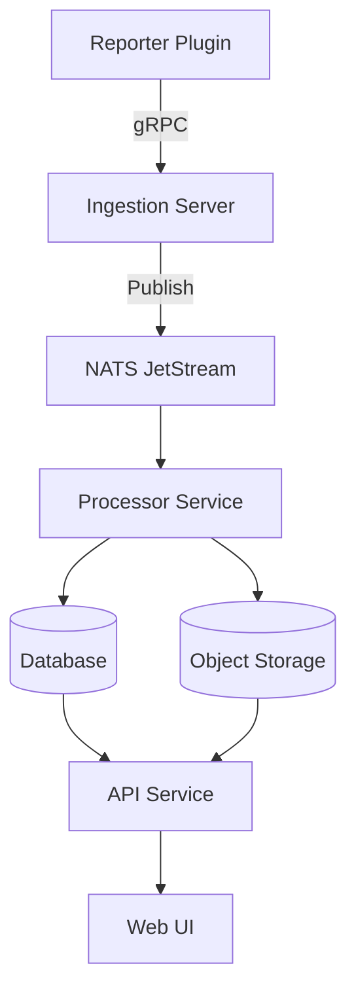

# Data Flow

---

## Event Lifecycle

1. Reporter sends events over gRPC (`TestStarted`, `Step`, `AttachmentAdded`, etc.).
2. Ingestion publishes validated events to NATS.
3. Processor consumes, persists data and artifacts.
4. Processor emits summaries → API caches or indexes them.
5. UI displays data via the API.

---

## Observability & Reliability

- Backpressure managed via NATS JetStream.
- DLQ (dead letter queue) for failed events.
- OpenTelemetry spans across all services.
- Prometheus metrics on `/metrics` endpoints.
