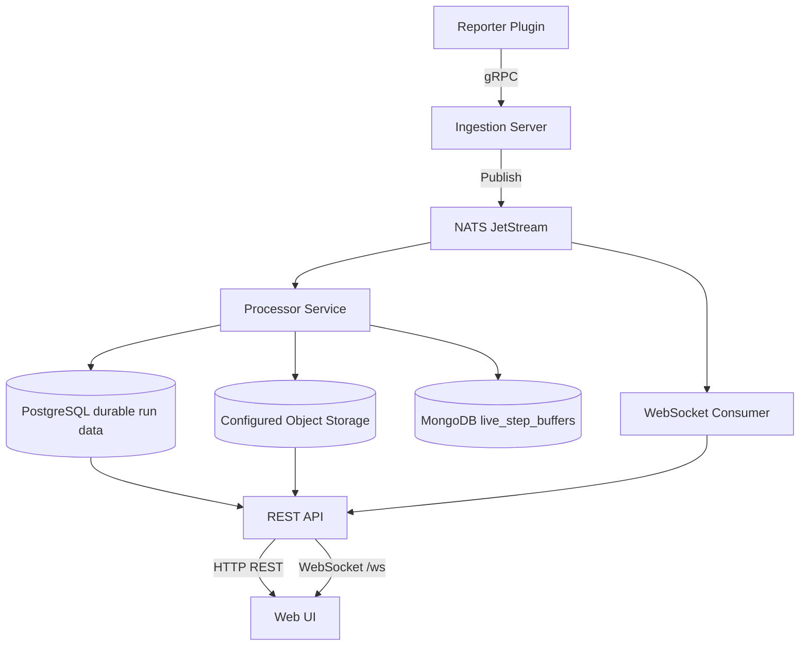

# Data Flow

```mermaid
flowchart TD
  A[Reporter Plugin] -->|gRPC| B[Ingestion Server]
  B -->|Publish| C[NATS JetStream]
  C --> D[Processor Service]
  C --> I[WebSocket Consumer]
  D --> E[(PostgreSQL durable run data)]
  D --> M[(MongoDB live_step_buffers)]
  D --> F[(Configured Object Storage)]
  E --> G[REST API]
  F --> G
  I --> G
  G -->|HTTP REST| H[Web UI]
  G -->|WebSocket /ws| H
```

---

## Event Lifecycle

1. Reporter sends events over gRPC (`TestStarted`, `Step`, `AttachmentAdded`, etc.).
2. Ingestion publishes validated events to NATS.
3. Processor consumes events and persists durable run data to PostgreSQL; MongoDB is used for the live-step buffer and attachments use configured object storage.
4. **The WebSocket consumer (part of the API service) relays events to connected web clients in real time when NATS is configured.**
5. Processor summaries and API caching/indexing were design goals; they are not separate current event streams.
6. UI displays data via REST and receives real-time updates via WebSocket.

---

## Observability & Reliability

- Backpressure is managed via NATS JetStream.
- DLQ (dead letter queue) for failed events is planned; there is no current dedicated DLQ flow.
- OpenTelemetry spans across all services are planned, not implemented.
- Prometheus metrics on `/metrics` endpoints are planned, not currently registered.
- Kafka and GraphQL are design options, not current paths.
